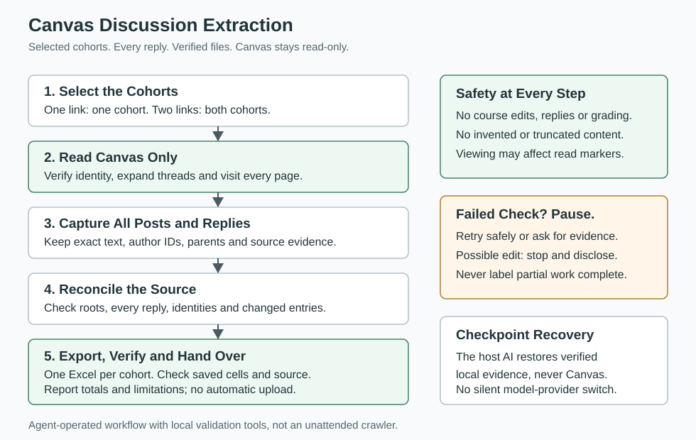
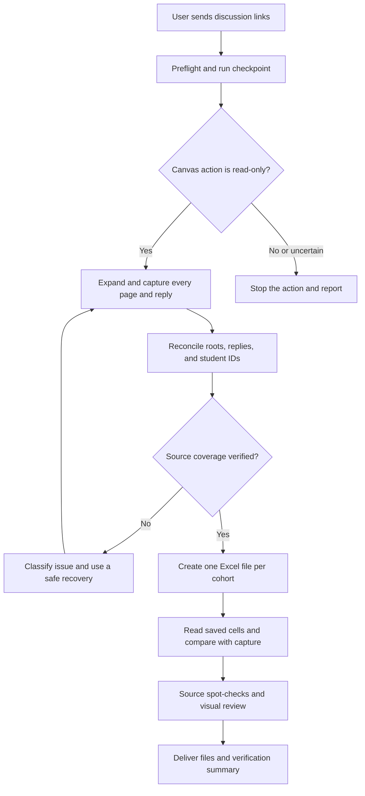

# Canvas Discussion Extractor

A portable agentic workflow for extracting Canvas discussion posts and all replies into cohort-specific Excel workbooks, with Canvas kept read-only.

This project packages a reusable workflow, installable skill, portable prompt, recovery procedures, and verification tools. It follows the operating-playbook structure of [CoEqual Assignment Creator](https://github.com/dalalbhavik01/coequal-assignment-creator), adapted for discussion extraction rather than assignment creation.

To use it on another device, install the skill or provide the portable prompt, sign in to Canvas in that device's supported browser, and run `\discussion [Canvas discussion link]`.

## At A Glance



The AI agent reads selected discussions, captures posts and replies with source evidence, checks completeness, and prepares one Excel workbook per cohort. Local tools validate captures and compare saved workbook cells. The workflow ends with local files and a verified handoff; it does not grade submissions or upload them to CoEqual.

## What It Does

- Extracts all discussion posts and replies, including replies beyond the second and nested replies.
- Supports one cohort, multiple cohorts, or an explicitly selected subset.
- Keeps cohort files separate and attributes each reply to its writer using verified student IDs.
- Preserves authored wording, paragraph breaks, links, and verified attachment references.
- Reconciles root threads and reply counts to detect incomplete captures and virtualized-page gaps.
- Creates a `Posts and Replies` sheet and a source-mapping `Audit` sheet.
- Verifies saved cells and reports per-cohort totals and unresolved source issues.
- Maintains checkpoints and uses the current host AI for bounded, evidence-based recovery.

## Primary Trigger

For one cohort:

```text
\discussion [Canvas discussion link]
```

For both cohorts:

```text
\discussion [cohort 1 discussion link] [cohort 2 discussion link]
```

For a selected cohort:

```text
\discussion [cohort 1 discussion link] [cohort 2 discussion link]
Only cohort 1. Do not extract cohort 2.
```

The agent verifies the mapping; "cohort 1" does not automatically mean the first open tab.

For Codex accounts with the skill installed:

```text
$discussion [Canvas discussion link]
```

For Claude or another browser-capable agent, supply the [portable workflow prompt](skills/discussion/references/portable-workflow.md), then ask:

```text
Run the discussion extraction workflow for these Canvas links: [discussion links]
Keep Canvas read-only. Capture all posts and replies, keep cohorts separate,
and verify the Excel files before handing them over.
```

`\discussion` is the conversational trigger, not a custom command registered with the app. The host needs permitted browser and file tools; this repository does not provide a Canvas login or run an unattended browser service.

## Safety Promise

Canvas is treated as read-only. The workflow must not:

- Edit, save, publish, unpublish, delete, or manage course content.
- Reply, post, grade, or change feedback, settings, groups, or submissions.
- Call Canvas APIs, bypass authentication, or use inspection capabilities prohibited by the host.
- Invent missing content, silently truncate replies, or merge students by name alone.
- Upload student data to CoEqual or another service as part of this extraction-only workflow.

Before every browser action, the agent checks its target and read-only scope. If an action may have changed Canvas, it stops browser interaction and reports what is known and uncertain without attempting an undo. Viewing discussions may change read/unread indicators; these are reported separately from course-content edits.

See the [Canvas read-only policy](skills/discussion/references/canvas-read-only-policy.md) for the full action rules.

## Workflow Diagram

The original discussion workflow is retained below. The overview above is the shorter visual guide. The original diagram's editable source is in [docs/workflow-diagram.mmd](docs/workflow-diagram.mmd).



The read-only action gate applies to every browser action, including recovery attempts. Failed verification blocks complete handoff; repair the affected stage or report the unresolved issue.

## Decision Levels

| Level | Meaning | Action |
| --- | --- | --- |
| L0 | Normal, verified path | Continue and checkpoint. A one-cohort request is normal scope. |
| L1 | Safe fallback preserving source truth | Retry within limits or repair local output, then verify the result. |
| L2 | Missing source, access, or decision | Pause affected work and ask. Independent authorized cohorts may continue. |
| L3 | Unsafe action or suspected mutation | Stop the action; suspected Canvas mutation stops all browser interaction. |

See [error handling](skills/discussion/references/error-handling.md), the [failure matrix](skills/discussion/references/comprehensive-error-handling-matrix.md), and [host-model escalation](skills/discussion/references/model-escalation.md).

Rollback restores a verified **local checkpoint**, never Canvas state. After interruption or a model change, verify checkpoint files, current instructions, scope, and source freshness before resuming. The workflow does not automatically switch providers or assume another model's memory transferred. See [checkpoint recovery](skills/discussion/references/checkpoint-recovery.md).

## Stage Verification

| Stage | What must be verified |
| --- | --- |
| Preflight | Current URLs, course/topic identity, selected cohorts, instructions, permitted tools. |
| Capture | Expansion, every page, all roots/replies, author IDs, parent relationships, evidence. |
| Reconciliation | Independent root coverage, known counter semantics, stable versions, no unresolved conflicts. |
| Export | Selected cohorts only, all reply columns, exact text, audit mappings, fresh output directory. |
| Readback | Valid manifest, expected workbooks/sheets, matching saved cells, no formulas or extra content. |
| Final review | Legible layout, source spot-checks, freshness, totals, exclusions and limitations. |

Use the [verification checklist](skills/discussion/references/verification-checklist.md) at checkpoints and handoff. Source completeness and saved-cell preservation are separate checks; passing one does not establish the other.

## Workbook Format

Each requested cohort receives a separate `.xlsx` file. The first sheet is `Posts and Replies`:

| Student Name | Discussion Post | Reply 1 | Reply 2 | Reply 3... |
| --- | --- | --- | --- | --- |
| One row per student | All top-level posts by that student | First peer reply | Second peer reply | Every additional peer reply |

Replies belong to their writer, not the thread owner. Self-follow-ups, replies to staff, and staff content remain in the `Audit` sheet and local capture, separately from peer reply columns. Quotes and attachments retain their documented treatment. Blank cells do not establish missing work or grades.

Gradebook order requires a current verified ordered roster; otherwise the agent reports captured author order. CoEqual support for extra reply columns must be checked before an actual import. This workflow does not perform that import.

## Repository Structure

```text
.
|-- README.md
|-- config.example.json
|-- docs/
|   |-- README.md
|   |-- workflow-diagram.svg
|   |-- workflow-diagram.mmd
|   |-- agentic-architecture.md
|   |-- development.md
|   |-- reliability-audit.md
|   `-- old-repo-comparison.md
|-- skills/
|   `-- discussion/
|       |-- SKILL.md
|       |-- agents/openai.yaml
|       |-- references/
|       |   |-- workflow.md
|       |   |-- portable-workflow.md
|       |   |-- transfer.md
|       |   |-- canvas-read-only-policy.md
|       |   |-- error-handling.md
|       |   |-- comprehensive-error-handling-matrix.md
|       |   |-- model-escalation.md
|       |   |-- checkpoint-recovery.md
|       |   |-- run-state-template.json
|       |   |-- verification-checklist.md
|       |   |-- failure-drills.md
|       |   `-- data-contract.md
|       `-- scripts/
|           |-- prepare.mjs
|           |-- build_workbooks.mjs
|           |-- restore_text_cells.py
|           `-- verify_workbooks.py
`-- tests/
```

The [documentation index](docs/README.md) links every guide by purpose. Operational instructions live inside the skill so copying it transfers the complete workflow without duplicated policy files drifting apart.

## Quick Start

1. Install the complete `skills/discussion` folder in your host's skills location, or supply the portable prompt.
2. Sign in to Canvas manually in a browser the host can operate.
3. Provide current discussion links and any cohort-selection or ordering instructions.
4. Run `\discussion [Canvas discussion link]`.
5. Let the agent capture, reconcile, export and verify using the workflow's gates.
6. Review the returned file links, cohort totals and limitations before using the workbooks in CoEqual.

No Canvas API token or OAuth integration is required. The host also needs file/spreadsheet tools, as described in the transfer guide.

## Setup On Another Device

For a Codex account, ask its skill installer:

```text
Install the discussion skill from
https://github.com/dalalbhavik01/canvas-discussion-extractor/tree/main/skills/discussion
```

Alternatively, clone the repository and install the complete `skills/discussion` folder. Keep its entrypoint, references, metadata and scripts together. Check for customizations before replacing an existing installation. No ZIP is required.

For another agent, provide the [portable prompt](skills/discussion/references/portable-workflow.md) and ensure it can use its own permitted browser and spreadsheet tools. Follow the [transfer guide](skills/discussion/references/transfer.md) for runtime requirements and export commands.

Optional defaults are in [config.example.json](config.example.json). The agent interprets them; scripts accept explicit input/output paths and cohort keys. Keep private configuration and outputs outside version control. Install new dependencies only in isolated project environments, not globally.

## Portability

The workflow depends on verified evidence, not a particular course, account, model or browser. The host may use the included exporter when the required runtime is available, or another supported exporter followed by independent readback.

Do not transfer login cookies, credentials, student records, grades or machine-specific paths with the skill. Installing it does not transfer a Canvas session. See [architecture](docs/agentic-architecture.md) for the division between agent responsibilities and local tools.

## Testing and Limitations

The latest reliability audit passed **55 synthetic tests** covering capture validation, cohort selection, workbook exports and verifier failures. Live Canvas extraction, real model handoffs and CoEqual import acceptance still require supervised verification. The safeguards do not guarantee coverage of every future UI failure.

See [development and test commands](docs/development.md), [failure drills](skills/discussion/references/failure-drills.md), and the [reliability audit](docs/reliability-audit.md) for reproducible checks and remaining limits.

## Core Principle

Continue autonomously when evidence supports a safe action. When scope, identity, completeness or Canvas integrity cannot be established, preserve the evidence and report the precise issue. Never replace missing evidence with a successful-looking workbook.
