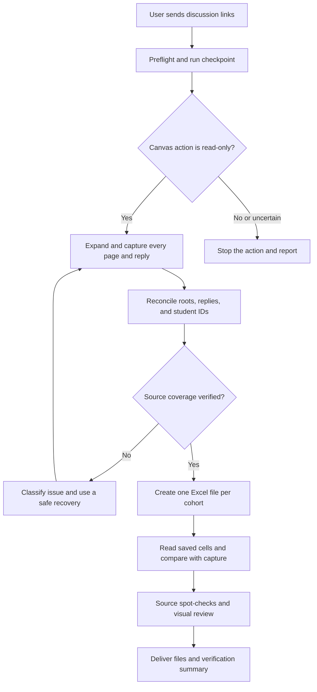

# Canvas Discussion Extractor

A portable agent skill for extracting Canvas discussion posts and **all** replies into section-specific CoEqual workbooks. Inspired by the workflow structure of [coequal-assignment-creator](https://github.com/dalalbhavik01/coequal-assignment-creator).

## Use

Install `skills/discussion` in your agent's skills folder, then invoke:

```text
\discussion <discussion URL for cohort 1> <discussion URL for cohort 2>
```

`\discussion` is the primary conversational trigger, just as `\createAssignment` is in the old repo. `$discussion <URLs>` also works as the native Codex skill invocation. No custom backslash command is registered with the application.

The agent uses an authenticated browser supplied by the user. This is an agent-assisted extraction workflow, not a standalone crawler. It requires no Canvas API token or OAuth integration. Browser access and permitted inspection capabilities depend on the host. No credentials or student records ship with the skill.

One-cohort requests are supported directly: `\discussion <section 1 URL> only section 1`. The agent resolves the selected cohort from source evidence and excludes unrequested cohorts, even when their tabs or captures are available. The exporter supports repeated `--section EXACT_KEY` flags for selecting from an existing capture.

## Output

Each section gets its own `.xlsx`. The first sheet is `Posts and Replies`, with `Student Name`, `Discussion Post`, `Reply 1`, `Reply 2`, and additional reply columns as needed. Rows represent authors, not threads. Replies belong to their writer, not the author of the thread they answered. An `Audit` sheet maps rows and cells back to entry IDs. Local JSON records preserve extraction evidence and original captured text.

The workflow reconciles thread counts, validates parent relationships, preserves multiple initial posts, and verifies saved workbook cells. An extraction that cannot establish completeness stays incomplete. It does not grade or upload to CoEqual.

## Transfer and Development

See [transfer instructions](skills/discussion/references/transfer.md) for installation, dependencies, generic-agent use, and packaging. The entire skill is self-contained under `skills/discussion`. For a host without skill installation, provide the [portable prompt](skills/discussion/references/portable-workflow.md). Optional run defaults are in [config.example.json](config.example.json); the agent interprets them, and scripts continue to accept explicit capture/output paths.

## Workflow and Recovery



| Level | Meaning | Response |
| --- | --- | --- |
| L0 | Expected, verified operation | Continue and checkpoint. |
| L1 | Safe recovery preserving source content | Retry once or use a permitted fallback; record it. |
| L2 | Missing input or unresolved source decision | Pause affected work and ask a specific question. |
| L3 | Suspected mutation or unsafe action | Stop the action immediately and disclose evidence. |

The host agent owns recovery decisions. See [architecture](docs/agentic-architecture.md), [error handling](skills/discussion/references/error-handling.md), [failure matrix](skills/discussion/references/comprehensive-error-handling-matrix.md), and [verification checklist](skills/discussion/references/verification-checklist.md). Routine read-only actions need no repeated approval. Live-source failures cannot be made to pass by changing expected counts.

Unlisted cases use the [host-model recovery procedure](skills/discussion/references/model-escalation.md): the current model evaluates evidence, selects a permitted recovery, verifies the outcome, and resumes or reports the specific blocker. This is portable across host models; it does not claim automatic provider switching or exhaustive coverage of every possible future failure.

## Repository Structure

```text
README.md
config.example.json
docs/
  agentic-architecture.md
  old-repo-comparison.md
skills/discussion/
  SKILL.md
  agents/openai.yaml
  references/
    workflow.md
    canvas-read-only-policy.md
    error-handling.md
    comprehensive-error-handling-matrix.md
    verification-checklist.md
    run-state-template.json
    failure-drills.md
    portable-workflow.md
    transfer.md
    data-contract.md
  scripts/
    prepare.mjs
    build_workbooks.mjs
    restore_text_cells.py
    verify_workbooks.py
tests/
```

This follows the old repo's playbook/skill/recovery structure, adapted for discussion extraction. The [comparison](docs/old-repo-comparison.md) records what was carried over and what belongs only to assignment creation. Operational references live inside the skill so copying that folder also transfers its safety and recovery instructions.

Run the dependency-free checks with Node.js 20 or newer:

```sh
node --test tests/discussion.test.mjs
```

With the host's spreadsheet runtime available, `node --test tests/selection_export.test.mjs` also builds and independently reads one-cohort workbooks from two-cohort captures, checking that excluded student data is absent.

To exercise actual workbook exports, generate synthetic captures with `node tests/export_fixture.mjs capture.json`, run the builder and verifier from the transfer guide, then run `DISCUSSION_TEST_EXPORT=/path/to/synthetic/export python3 -m unittest discover -s tests -p 'test_*.py'`. Keep synthetic captures under `outputs/`; never run mutation tests against real student work.

The optional Excel export uses the host's `@oai/artifact-tool` runtime. It never installs packages globally. Use [the data contract](skills/discussion/references/data-contract.md) to supply a capture, then follow [the workflow](skills/discussion/references/workflow.md).

## Verification Boundary

Offline tests cover synthetic records, not a live Canvas session. A passing workbook comparison proves that export preserved the supplied capture; it does not independently prove that the capture includes everything on Canvas. That requires page coverage, count evidence, and source spot-checks for each actual run. CoEqual acceptance of extra reply columns must be checked in the target account before upload.

Canvas course content is never edited by this workflow. Viewing discussions may change read/unread state. Unexpected clicks or suspected mutations are reported immediately, without attempting a reversal.
